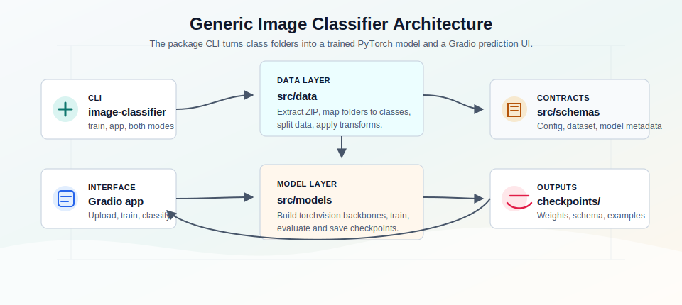
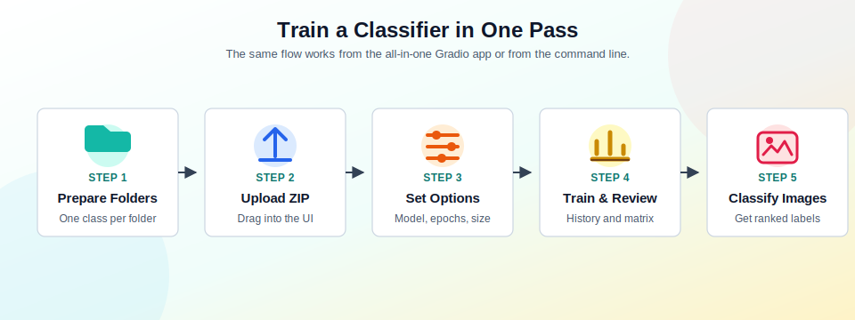
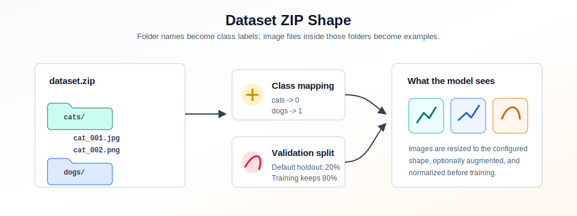
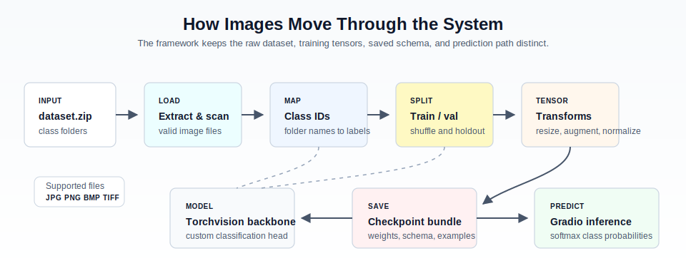
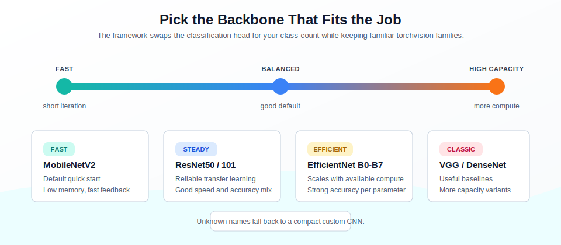

<p align="center">
  
</p>

# Generic Image Classification Framework

[](https://github.com/alhussein-jamil/generic-image-classifier/actions/workflows/ci.yml)
[](https://www.python.org/downloads/)
[](LICENSE)
[](https://github.com/astral-sh/ruff)
[](https://github.com/astral-sh/uv)
[](https://pytorch.org/)
[](https://gradio.app/)

Train a custom image classifier from your own folder-labeled images, then test it in a friendly Gradio interface. The project wraps a practical PyTorch transfer-learning pipeline around a simple workflow: upload a ZIP, pick a backbone, train, review results, and classify new images.

## What It Does

- Trains an image classifier from a `dataset.zip` where each folder is one class.
- Uses torchvision backbones such as MobileNetV2, ResNet, DenseNet, VGG, and EfficientNet.
- Handles extraction, class mapping, train/validation splitting, augmentation, normalization, and checkpoint saving.
- Shows training history, confusion matrix, and ranked prediction probabilities in Gradio.
- Supports an all-in-one app flow as well as CLI-driven training.

## The Big Picture



The CLI coordinates the data layer, model factory, typed configuration schemas, and Gradio UI. Training produces a checkpoint bundle with weights, model metadata, config, and example images.



## Quick Start

Requires Python 3.11+ and [uv](https://docs.astral.sh/uv/).

```bash
git clone https://github.com/alhussein-jamil/generic-image-classifier.git
cd generic-image-classifier
uv sync
```

Launch the all-in-one Gradio app:

```bash
uv run image-classifier
```

Then open the local Gradio URL, upload a dataset ZIP, choose training settings, train the model, and classify test images from the same interface.

Train then launch:

```bash
uv run image-classifier --mode both --zip dataset.zip --model mobilenetv2 --epochs 10
```

Training only:

```bash
uv run image-classifier --mode train --zip dataset.zip --model resnet50 --epochs 20
```

## Dataset Format

Your ZIP file should contain one directory per class. Directory names become the labels the model learns.



```text
dataset.zip
├── cats/
│   ├── cat_001.jpg
│   └── cat_002.png
├── dogs/
│   ├── dog_001.jpg
│   └── dog_002.png
└── birds/
    ├── bird_001.jpg
    └── bird_002.png
```

Supported image extensions are `.jpg`, `.jpeg`, `.png`, `.bmp`, `.tif`, and `.tiff`.

## How Training Works



1. The ZIP is extracted into a working directory.
2. Folder names are converted into numeric class IDs.
3. Images are shuffled and split into training and validation sets.
4. Training images can receive augmentation; validation images stay deterministic.
5. A pretrained backbone gets a new classification head for your class count.
6. The checkpoint, schema, config, and example images are saved under `checkpoints/`.

## Model Choices



Start with `mobilenetv2` for fast iteration. Move to `resnet50`, `densenet121`, or `efficientnetb0` when you need a stronger baseline. Larger variants such as `resnet152` or `efficientnetb7` can improve accuracy on suitable datasets, but they need more time and memory.

## Useful Commands

```bash
uv run image-classifier --help
uv run image-classifier --mode train --zip dataset.zip --img_size 224 224 --batch_size 32
uv run image-classifier --mode train --zip dataset.zip --save_config config.json
uv run python -m generic_image_classifier --mode app
```

## Development

```bash
make help          # list commands
make dev           # install dev deps
make app           # launch Gradio UI
make train ZIP=dataset.zip
make check         # lint + test
```

Or directly:

```bash
uv sync --dev
uv run pre-commit install
uv run pytest
uv run ruff check src tests
```

CI runs lint and tests on push/PR.

## Project Structure

```text
.
├── pyproject.toml
├── src/generic_image_classifier/
│   ├── cli.py             # CLI entrypoint
│   ├── pipeline.py        # shared training workflow
│   ├── config/            # config load/save helpers
│   ├── data/              # ZIP loading, transforms, dataloaders
│   ├── models/            # backbones, training, inference
│   ├── schemas/           # config, dataset, model dataclasses
│   └── ui/                # Gradio app and plots
├── tests/
└── assets/images/
```

## Outputs

Training writes artifacts to `checkpoints/`, including:

- Model weights (`*_best.pt`)
- Model schema JSON (class mapping, metrics, input shape)
- Config JSON
- Example validation images for the Gradio app

## Responsible Use

This project is a general-purpose image classification starter, not a certified diagnostic system. For medical, safety, or other high-stakes workflows, treat outputs as experimental decision support and validate with domain experts, representative data, and appropriate review before any real-world use.

## License

Apache 2.0 — see [LICENSE](LICENSE).
